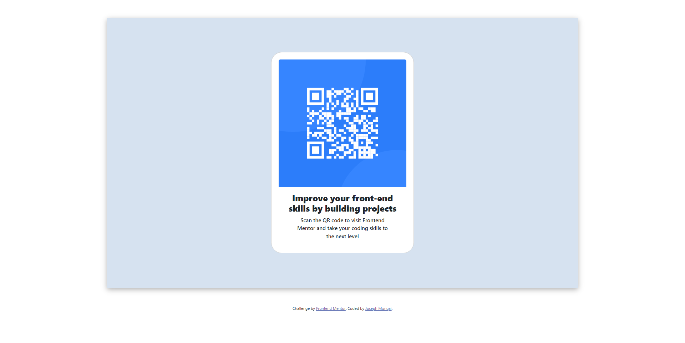

# Frontend Mentor - QR Code Component Solution

This is a solution to the [QR code component challenge on Frontend Mentor](https://www.frontendmentor.io/challenges/qr-code-component-iux_sIO_H). Frontend Mentor challenges help you improve your coding skills by building realistic projects.

## Table of Contents

- [Overview](#overview)
  - [Screenshot](#screenshot)
  - [Links](#links)
- [My Process](#my-process)
  - [Built with](#built-with)
  - [What I Learned](#what-i-learned)
  - [Continued Development](#continued-development)
  - [Resources](#resources)
- [Author](#author)
- [Acknowledgments](#acknowledgments)

## Overview

### Screenshot


.png)

Add a screenshot of your solution. The screenshot showcases the QR code component as it appears on different devices.

### Links

- Solution URL: [Add solution URL here](https://github.com/Mungai47/QR-Code)
- Live Site URL: [Add live site URL here](https://frontend-mentor-qr-code-sol.netlify.app/)

## My Process

### Built with

- HTML5
- CSS3 (including Flexbox)
- Bootstrap 5
- JavaScript (Bootstrap JS)

### What I Learned

During the completion of this project, I learned how to create a responsive QR code component using HTML, CSS, and Bootstrap. I gained experience in structuring content, applying responsive design principles, and incorporating third-party libraries.

Here's an example of code where I customized the QR code container:

```css
.qr-code {
    background-color: hsl(212, 45%, 89%);
    width: 100%;
    height: auto;
    display: flex;
    justify-content: center;
    align-items: center;
    padding: 10vh 0;
    box-shadow: 0 5px 15px rgba(0, 0, 0, 0.3);
}
```

## Continued Development

In future projects, I aim to further enhance my skills in JavaScript and explore advanced CSS techniques. Additionally, I plan to focus on improving my understanding of front-end frameworks such as React and Vue.js.

## Resources

While working on this challenge, I found the following resources to be particularly helpful:

- **Bootstrap Documentation** - Comprehensive guide to using Bootstrap for responsive design.
- **Frontend Mentor Community** - Engaging discussions and solutions from fellow developers.

## Author

- **GitHub** - [Mungai47](https://github.com/Mungai47)
- **Frontend Mentor** - [@Josephmungai99](https://www.frontendmentor.io/profile/Josephmungai99)
- **Twitter** - [@joseph_mungai_](https://twitter.com/joseph_mungai_)

## Acknowledgments

I'd like to express my gratitude to the Frontend Mentor community for providing an opportunity to enhance my coding skills through this challenge. Special thanks to [Mentor Name] for their guidance and inspiration during this project.
